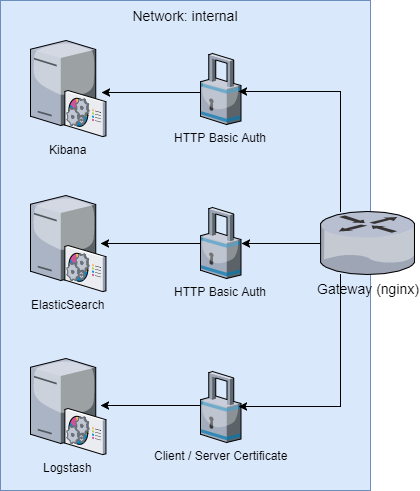

# ELK Stack Docker

This project bundles Kibana, ElasticSearch and Logstash using Docker. Nginx is used as a gateway to the network. Each component is provided using a separate docker container which is orchestrated by using docker-compose

Further information: <https://www.elastic.co/de/products>

## Network structure

The Kibana, ElasticSearch and Logstash containers are running within the same "Docker" network and are only accessible from within the network. For external access an additional nginx container is used as a gateway which also secures access to the ELK stack containers.

*External* access to Kibana and ElasticSearch is secured using HTTP Basic Authentication (See *Configuration -> nginx*). Traffic to these two containers is reverse proxied by the nginx gateway.  
*External* access to Logstash is secured using client / server certificates. Traffic to Logstash is passed through the nginx gateway as it is encrypted.



## Project structure

`/cert-scripts` -> OpenSSL working directory  
`/certs` -> Generated CA, server and client keys and certificates  
`/example` -> Example log producer and filebeat Docker container images
`/logstash` -> Logstash Docker image
`/nginx` -> Nginx Docker image  
`*.sample` -> templates for config files

## Prerequisites

```
docker
docker-compose
```

## Getting started

1. Create necessary project directories and config files
   - Run `init-project.sh`
1. Configure -> See Configuration
1. Generate certificates and keys
  - Run `generate-certs.sh -a` to generate CA, server and client (all) keys and certificates **(Recommended for first usage)**
  - Run `generate-certs.sh -s` to server keys and certificates
  - Run `generate-certs.sh -c` to client keys and certificates
1. Run docker-compose
  - `docker-compose up -d --build`

## Example / Test Setup

  1. Create necessary project directories and config files
    - Run `init-project.sh`    
  1. Generate certificates and keys
    - Run `generate-certs.sh -a` to generate CA, server and client (all) keys and certificates
  1. Copy client certificates to filebeat directory
    - Run `install-test-certs.sh`
  1. Run docker-compose
    - `docker-compose -f docker-compose.test.yml up -d --build`
  1. Open `localhost:5601` in browser to access Kibana
    - **Start up of Kibana may take a few minutes**
    - `user: kibana`
    - `password: kibana`
    - Create index
    - one log entry per second should appear    

## Configuration

### nginx (gateway) `nginx/conf`
File / Directory | Description
--- | ---
`nginx.conf` | General nginx options
`/passwords` | Change users and passwords for ElasticSearch and Kibana HTTP Basic Authentication
`/sites` | Customize proxy routes for ElasticSearch and Kibana
`/streams` | Customize logstash stream

### OpenSSL / Certificate Generation
File / Directory | Description
--- | ---
`cert-scripts/openssl.cnf.template` | Customize OpenSSL
`ca.csr.conf` | CA CSR
`server.csr.conf` | Server CSR
`clients.csr.conf` | Clients CSR - multiple clients are supported

### External ports
* Create `.env` file or rename `.env.sample`
```
KIBANA_EXTERNAL_PORT=8800
LOGSTASH_EXTERNAL_PORT=8801
ELASTICSEARCH_EXTERNAL_PORT=8802
```
See <https://docs.docker.com/compose/environment-variables/>


## Resources

- <https://jamielinux.com/docs/openssl-certificate-authority/create-the-root-pair.html>
- <https://www.digitalocean.com/community/tutorials/how-to-install-elasticsearch-logstash-and-kibana-elk-stack-on-ubuntu-14-04>
